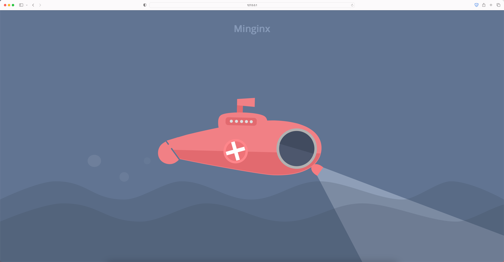

<h1 align="center">Minginx</h1>
<div align="center">
	
    
  	
  <a href="https://blog.rust-lang.org/2022/09/22/Rust-1.64.0.html">
    
  </a>
  <p align="center"> A simple Http server implemented using Rust </p>
</div>


# Introduction

Warning：本项目为合肥工业大学2023年计算机网络课程设计：WEB服务器的设计。仅供学习使用，请勿用于实际需求。

## 特性

- 使用 Tokio 库，支持高并发，在课程设计验收中可以达到500000+并发量，是其他组的3倍以上。
- 并未使用 Rust 中更加高级的 Crates，仅使用标准库中最基本的方法实现。
- 代码精简高效，核心代码量仅500行左右，仅约为其他组的30%，但运行效率仍然非常高。
- 实现了解析静态网页的功能，可以正确响应 Http 1.1 的 GET 请求，支持图片、文本、视频等文件格式，输入不存在的文件路径时可以正确返回404页面。
- 支持日志功能，可以通过传入参数 `--log` 开启日志功能。默认关闭，仅记录服务器错误。
- 支持响应 `PHP` 页面，可以通过传入参数 `--php` 开启对 PHP 脚本的解析，需要预先配置 PHP 运行时环境。
- 支持跨平台，可以在 ``Linux`、`Windows` 以及`Mac`系统正确运行。
- 支持访问文件夹，在地址栏访问文件夹即可列出当前目录中所有的文件，点击即可跳转。
- 支持自定义绑定的端口，可以通过传入参数 `--port` 或者 `-p` 指定需要的端口号，默认在5000端口启动。
- 支持 `/count` 和 `/echo?key=value` 等请求方法。

## To do：

- 完善对 Post 请求对处理
- 添加对数据库的连接配置
- 向 PHP 页面传递参数（GET 和 POST）
- 对视频文件的响应分块进行

## 运行时截图




## Command Line Arguments

```shell
Minginx 1.0
Qi Ming <qimingme@gmail.com>
run server

USAGE:
    minginx [OPTIONS]

OPTIONS:
    -h, --help           Print help information
        --log            Enables logging
    -p, --port <PORT>    Sets a custom port
        --php            Enables php
    -V, --version        Print version information
```


# Installation

## run by cargo

```shell
# 可选地可以通过修改 rustup 的镜像地址（修改为中国科学技术大学的镜像服务器）来加速下载
export RUSTUP_DIST_SERVER=https://mirrors.ustc.edu.cn/rust-static
export RUSTUP_UPDATE_ROOT=https://mirrors.ustc.edu.cn/rust-static/rustup

# Install rust
curl https://sh.rustup.rs -sSf | sh

# 设置环境变量
source $HOME/.cargo/env

# 确认一下正确安装了 Rust 工具链
rustc --version

git clone https://github.com/Qiming01/Mingnix.git

cd mingnix

# 运行
cargo run --release
```

## example

```shell
cargo run --release -h			# get for help
cargo run --release -p 8080		# 指定8080端口启动服务器
cargo run --release --log		# 开启日志功能
cargo run -- release --php		# 开启解析php的功能（前提：配置好PHP环境）
```

